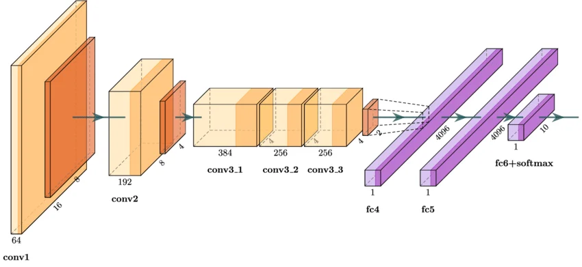

<figure>
  
  <figcaption style="text-align: center;">Sketch of the AlexNet deep neural network. A pivotal model in the history of deep learning.</figcaption>
</figure>

 

# Deep Learning (CAS machine intelligence, 2026) 

This course in deep learning focuses on practical aspects of deep learning. We therefore provide jupyter notebooks ([complete overview of all notebooks](https://github.com/deep-learning-ids/deep_learning_fs26/tree/main/notebooks) used in the course). 

For doing the hands-on part we recommend to use [google colab](https://colab.research.google.com). You will need an internet connection and may also need a google account. See the [instructions how to use google colab](co.md).

If you want to do work locally (e.g. in order to avoid needing an internet connection) you can install anaconda ([details and installation instruction](co.md)). Please note that we are not experts in anaconda and thus can only give limited support. Some examples may require extra effort to run smoothly in a custom installation.

To easily follow the course please make sure that you are familiar with some [basic math and python skills](prerequistites.md).  

## Info for the projects

Your Leistungsnachweis for this course is a project. You can join together in small groups and choose a topic for your DL project. You should prepare a poster and a spotlight talk (5 minutes) which you will present on the last course day. To get some hints on how to create a good poster you can check out the links that are provided below under "Guidelines for designing a good poster".

If you need free GPU resources, we again refer you to the [instructions how to use google colab](co.md).  

Examples for projects from previous versions the DL course:
  [2020](https://docs.google.com/spreadsheets/d/1NXinRQMifg_QNQs1fyn5HeiZNRnTGnIy1W7-ij-jQhg/edit?usp=sharing)
  [2021](https://docs.google.com/spreadsheets/d/18VFrPbKq3YSOg8Ebc1q1wGgkfgaWl7IkcCClGEDGj6Q/edit#gid=0)
  [2022](https://docs.google.com/spreadsheets/d/1TZf5hKekzOlBC7J0-EAltGOMTuZyrDhHu3ANve0q6H4/edit#gid=0)
  [2023](https://docs.google.com/spreadsheets/d/1d1y-Qf9OW7Vg30WzWwCckYPBMyRcg-d-qLG_lA0Z5jk/edit#gid=0)
  [2024](https://docs.google.com/spreadsheets/d/1drTY6DA2R5QQYk8mRvcPFx-lW98aOGLgppkMMweHZPM/edit#gid=0)

Open Datasets: 
- [papers with code](https://paperswithcode.com/datasets)
- [kaggle](https://www.kaggle.com/datasets)
- Search for interesting data repositories online: there are a lot of options...

Hints: 
- [Upload data to colab](https://colab.research.google.com/notebooks/io.ipynb)
- [keras with your own images](https://keras.io/api/data_loading/)

 
**Fill in the Title and the Topic of your Projects until End of Week 4 [here](https://zhaw.sharepoint.com/:x:/r/sites/ZHAW-CLASS-DeptT-CASMAIN/Freigegebene%20Dokumente/DL/project-assignments-dl-fs26.xlsx?d=w610a5d96941b4827822ee3cbbbabc373&csf=1&web=1&e=K8MszJ)**

## Other resources 

We took inspiration (and sometimes slides / figures) from the following resources.

* Deep Learning Book (DL-Book) [http://www.deeplearningbook.org/](http://www.deeplearningbook.org/). This is a quite comprehensive book which goes far beyond the scope of this course. 

* Convolutional Neural Networks for Visual Recognition [http://cs231n.stanford.edu/](http://cs231n.stanford.edu/), has additional material and [youtube videos of the lectures](https://www.youtube.com/playlist?list=PLkt2uSq6rBVctENoVBg1TpCC7OQi31AlC). While the focus is on computer vision, it also treats other topics such as optimization, backpropagation and RNNs. Lecture notes can be found at [http://cs231n.github.io/](http://cs231n.github.io/).

* Probabilistic Deep Learning (DL-Book) [Probabilistic Deep Learning](https://www.manning.com/books/probabilistic-deep-learning?a_aid=probabilistic_deep_learning&a_bid=78e55885). This book is written by us the tensorchiefs and covers the increasingly popular probabilistic approach to deep learning.

* Math concept videos at [3blue1brown](https://www.youtube.com/@3blue1brown)

## Dates & Topics

The course is split in 8 sessions, each 4 lectures long. Topics might be adapted during the course

| Day  |      Date    |      Time    |   Topic
|:--------:|:--------------|:---------|:---------------|
| 1        | 05.05.2026 | 09:00-12:30 | Introduction to Deep Learning & Keras, Backpropagation, first NNs |
| 2        | 12.05.2026 | 09:00-12:30 | Loss, Optimization, Regression, Classification    |
| 3        | 19.05.2026 | 09:00-12:30 | Computer vision, CNN-archictecture  |
| 4        | 26.05.2026 | 09:00-12:30 | DL in practice, pretrained (foundation) models | 
| 5        | 02.06.2026 | 09:00-12:30 | Model evaluation, baselines, xAI, troubleshooting  |
| 6        | 09.06.2026 | 09:00-12:30 | Generative Models, Transformer-architecture   |
| 7        | 16.06.2026 | 09:00-12:30 | Vision Transformer  |
| 8        | 23.06.2026 | 09:00-12:30 | Projects; AI fairness, responsibility |

## Provided Material 

### Day 1

TODO: Update links

- Slides: [01_DL_Introduction]()
- Additional Material: [Network Playground](https://playground.tensorflow.org/)
- Notebooks:
  - [00_Checking_Correct_Installation_keras_torch.ipynb]() 
  - [01_simple_forward_pass_keras_torch.ipynb]() 

## Guidelines for designing a good poster

- https://projects.ncsu.edu/project/posters/
- https://projects.ncsu.edu/project/posters/60second.html
- https://projects.ncsu.edu/project/posters/documents/QuickReferenceV4.pdf
- https://www.slideshare.net/hmftj/scientific-posters-hmftj
- http://betterposters.blogspot.ch/